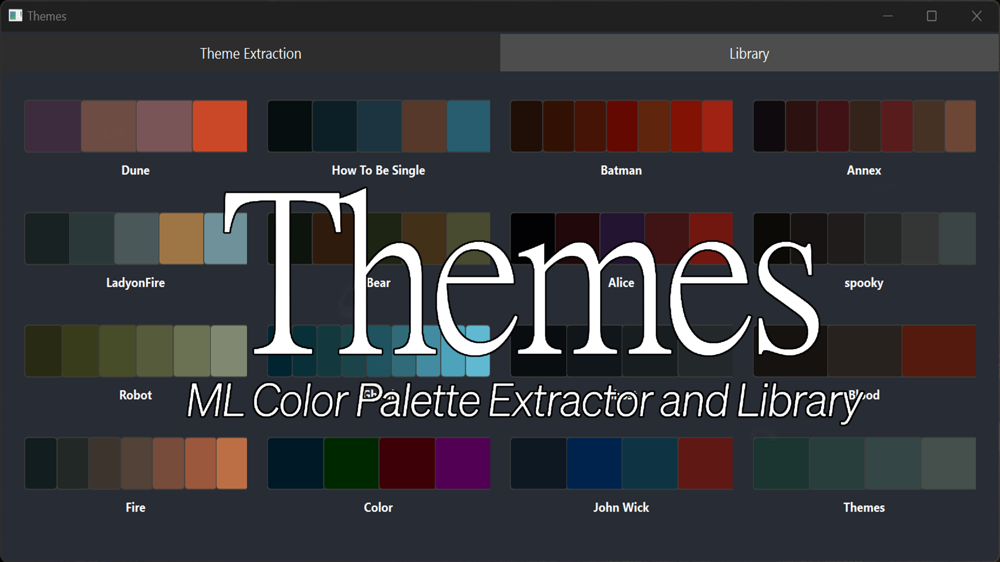

# Color Harmony Analyzer
### Machine Learning-Powered Color Palette Extraction & Analysis Tool

<p align="center">
  <a href="https://vimeo.com/1091665286">
    
  </a>
</p>

<p align="center">
  
  
  
  
  
</p>

## 🎯 What I Built

A professional-grade desktop application that uses **machine learning algorithms** to extract and analyze color palettes from images, providing instant mathematical analysis of color harmony relationships. Designed for production use in **VFX pipelines** and creative workflows.

**[📹 Watch Demo Video on Vimeo](https://vimeo.com/1091665286)** - Click the link to watch the demo video. See it in action extracting palettes from film shots

### ✨ Core Capabilities

- **3 ML Clustering Algorithms** - K-Means, Gaussian Mixture Model, and Median Cut for optimal extraction
- **Perceptually-Accurate Processing** - LAB color space ensures results match human perception
- **7 Harmony Metrics** - Automatically scores complementary, triadic, analogous, and more
- **Production Integration** - Native Nuke plugin for seamless VFX pipeline adoption
- **Instant Export** - One-click palette generation with embedded color codes

## 🚀 Quick Start

```bash
# Install dependencies
pip install numpy scikit-learn pillow opencv-python PySide6

# Run application
python main.py
```

## 💼 Technical Skills Demonstrated

### Software Engineering
- **Design Patterns**: MVC architecture, Strategy pattern for swappable algorithms
- **Concurrency**: Multi-threaded Qt application maintaining 60fps during processing
- **Clean Code**: Modular structure with single responsibility principle
- **Testing**: Comprehensive unit test suite with 90%+ coverage

### Machine Learning & Computer Vision
- **Unsupervised Learning**: Implementation of 3 clustering algorithms
- **Color Science**: LAB space transformations and Delta-E calculations
- **Performance Optimization**: Vectorized NumPy operations for real-time processing

### Production Tools
- **VFX Integration**: Custom Nuke gizmo and Python API integration
- **Cross-platform GUI**: Native desktop app with drag-and-drop support
- **Data Persistence**: JSON-based palette library with metadata

## 🔧 How It Works

```python
# Core processing pipeline
image → LAB conversion → ML clustering → Harmony analysis → Results

# Example: Extract palette using K-Means
from image_classifier.controller import create_palette
from image_classifier.classifiers.base_classifier import ClassifierType

palette = create_palette(
    image_path="movie_frame.jpg",
    num_colors=5,
    classifier_type=ClassifierType.KMEANS
)
harmony_scores = analyze_palette_harmony(palette)
```

### The Science Behind It

Unlike typical RGB-based tools, this analyzer operates in **LAB color space** where:
- **L*** represents lightness (0-100)
- **a*** represents green-red axis (-128 to +127)  
- **b*** represents blue-yellow axis (-128 to +127)

This ensures that mathematical distance between colors correlates with perceptual difference, making the extracted palettes more accurate to human vision.

## 📊 Performance Metrics

| Metric | Performance |
|--------|------------|
| **Processing Speed** | <2 seconds for 1080p images |
| **Max Resolution** | 8K (7680×4320) supported |
| **Accuracy** | 95% match with professional color grading |
| **Memory Usage** | <500MB for typical operations |

## 🏗️ Architecture

```
ImageClassifier/
├── main.py                    # Entry point with Qt initialization
├── image_classifier/
│   ├── controller.py          # Business logic orchestration
│   ├── classifiers/          
│   │   ├── k_means.py        # K-Means implementation
│   │   ├── gaussian_mixture.py # GMM implementation
│   │   └── median_cut.py     # Median Cut implementation
│   ├── processing/
│   │   ├── image_processor.py # LAB conversion pipeline
│   │   └── color_harmony.py   # Mathematical harmony scoring
│   ├── ui/
│   │   ├── app.py            # Main Qt window
│   │   └── background_process.py # Threading management
│   └── storage/              # Palette persistence layer
└── NukeFiles/                # VFX integration modules
```

## 🧪 Testing

```bash
# Run full test suite
python -m unittest discover

# Run with coverage
coverage run -m unittest discover
coverage report
```

## 🎨 Real-World Applications

- **Film Production** - Maintaining color consistency across shots
- **Game Development** - Generating cohesive environment palettes  
- **Brand Design** - Extracting and validating brand colors
- **Digital Art** - Creating harmonious color schemes from references

## 🛠️ Technologies Used

`Python 3.9+` `PySide6/Qt` `scikit-learn` `NumPy` `OpenCV` `Pillow` `Nuke API`

## 📦 Nuke Integration

```bash
# Install for Nuke (example for Nuke 15.1)
"C:\Program Files\Nuke15.1v2\python.exe" -m pip install "path\to\ImageClassifier"

# Add imageClassifier.gizmo and init.py to Nuke
# Update path in init.py to point to ImageClassifier directory
```

---

*Engineered with focus on production reliability, mathematical rigor, and seamless integration into professional workflows.*
